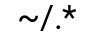

Harry Toigo's dotfiles  
----------------------

My personal set of configuration files, collected here to put them under version
control and to facilitate transferring them to new machines.

### Requirements

You must have GNU stow.

### Install

Clone this repository wherever you like (I use `~/dotfiles`). Then make your
current directory the newly created repo directory, and run the `install.sh`
script from there.

This will use GNU stow to _stow_ (i.e., install) these config files in your home
directory. With GNU stow, your config files become symlinks from their usual
locations to their locations within the dotfiles repo directory tree. The install
script will install GNU stow, if it is not already on your machine.

### Update

Todo.

### License

These dotfiles are copyright © 2018-2019 by Harry H. Toigo II. They are free
software, and may be redistributed under the terms specified in the
[`LICENSE`][] file.

[`LICENSE`]: /LICENSE

About Harry Toigo
-----------------

Harry Toigo loves open source software!
